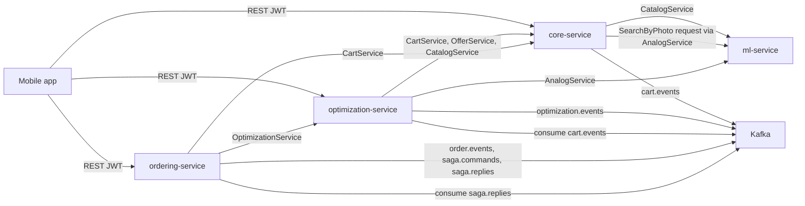

# FoodSea Backend Project Specification

Актуально для текущего checkout. Спека описывает фактический код и локальные `architecture-notes.md`; если код и старый документ расходятся, источником истины считается код плюс ближайший `architecture-notes.md`.

## 1. Назначение системы

FoodSea Backend обслуживает мобильное приложение для списка продуктов:

- регистрация, логин, refresh/logout, OAuth Google/Yandex;
- каталог продуктов, категории, бренды, цены по магазинам, поиск и barcode lookup;
- корзина пользователя и события об изменениях корзины;
- оптимизация корзины по магазинам и подбор аналогов;
- оформление заказа через Saga;
- ML-поиск аналогов и поиск товара по фото упаковки/OCR.

Система построена как набор сервисов с отдельными БД и явными межсервисными контрактами через gRPC/Kafka.

## 2. Сервисы

| Сервис | Язык | HTTP | gRPC | БД | Ответственность |
|--------|------|------|------|----|-----------------|
| `core-service` | Go | `8081` | `9091` | `core_db` | identity, catalog, partners, cart, search, barcode, images, photo_search |
| `optimization-service` | Go | `8082` | `9092` default, `9094` в `make dev-all` | `optimization_db` | optimization snapshots, analog adapter, result lock/unlock |
| `ordering-service` | Go | `8083` | `9093` | `ordering_db` | orders, Saga orchestration |
| `ml-service` | Python | нет | `50051` | нет SQL | analog search, batch analog search, photo search |

Локальная инфраструктура из `deploy/docker-compose.dev.yml`:

- PostgreSQL: `core-db:5433`, `optimization-db:5434`, `ordering-db:5435`;
- Redis: `localhost:6379`;
- Kafka/Zookeeper: `localhost:9092`, `localhost:2181`;
- MinIO: API `localhost:9000`, console `localhost:9001`.

## 3. Архитектурные правила

- Database per Service: сервисы не ходят в чужие SQL-БД.
- Go-модули следуют Clean Architecture: `domain` не зависит от Ent, Gin, Redis, Kafka или gRPC.
- Межсервисное чтение/команды идут через proto/gRPC, события и аудит — через Kafka.
- Деньги всегда в копейках (`int64`/`int` в Ent-схемах core), без `float`.
- UUID v4 используется как PK.
- Ошибки классифицируются sentinel errors и `errors.Is`.
- Redis реализует cache-aside или session/state storage, но не является source of truth для бизнес-сущностей.
- Kafka семантика: at-least-once, commit после успешной обработки; обработчики должны быть идемпотентными.
- Ent-схемы лежат в `services/<svc>/ent/schema`, Atlas migrations — в `services/<svc>/migrations`.

## 4. Репозиторий

```text
services/core/           Go core-service
services/optimization/   Go optimization-service
services/ordering/       Go ordering-service
services/ml/             Python ml-service
proto/                   Go module github.com/foodsea/proto
deploy/                  docker-compose.dev, k8s, VM scripts
docs/                    deployment, mobile agent guide, this specification
go.work                  workspace for proto + Go services
Makefile                 root commands
AGENTS.md                agent/operator rules for this repository
```

Корневые `01-architecture.md`, `02-tech-stack.md` и `prompts/` отсутствуют в текущем checkout. Не использовать их как доступные источники, пока файлы не восстановлены.

## 5. Межсервисная схема



## 6. HTTP API Surface

Все бизнес-REST endpoints имеют prefix `/api/v1`. `/health` и `/swagger/*any` находятся на корне каждого Go HTTP-сервиса.

### core-service

Public:

- `POST /api/v1/auth/register`
- `POST /api/v1/auth/login`
- `POST /api/v1/auth/refresh`
- `GET /api/v1/auth/oauth/:provider/start` при `OAUTH_LEGACY_ENABLED=true`
- `POST /api/v1/auth/oauth/:provider/callback` при `OAUTH_LEGACY_ENABLED=true`
- `GET /api/v1/auth/oauth/native/:provider/start` при `OAUTH_NATIVE_ENABLED=true`
- `POST /api/v1/auth/oauth/native/:provider/callback` при `OAUTH_NATIVE_ENABLED=true`
- `POST /api/v1/auth/oauth/native/:provider/sdk/callback` при `OAUTH_NATIVE_ENABLED=true` и `OAUTH_YANDEX_NATIVE_SDK_ENABLED=true`
- `GET /api/v1/categories`
- `GET /api/v1/brands`
- `GET /api/v1/products`
- `GET /api/v1/products/:id`
- `GET /api/v1/stores`
- `GET /api/v1/products/:id/offers`
- `GET /api/v1/search`
- `GET /api/v1/barcode/:code`

Protected by JWT:

- `POST /api/v1/auth/logout`
- `GET /api/v1/users/me`
- `POST /api/v1/users/me/onboarding`
- `GET /api/v1/cart`
- `POST /api/v1/cart/items`
- `PUT /api/v1/cart/items/:product_id`
- `DELETE /api/v1/cart/items/:product_id`
- `DELETE /api/v1/cart`
- `POST /api/v1/products/photo-search`

Admin group:

- `POST /api/v1/admin/products/:id/image`
- `DELETE /api/v1/admin/products/:id/image`

Текущая admin-группа в `core/cmd/api/main.go` не защищена middleware. Это важно учитывать перед использованием в production-like окружениях.

### optimization-service

Protected by JWT:

- `POST /api/v1/optimize`
- `GET /api/v1/optimize/:id`
- `GET /api/v1/analogs/:product_id`

### ordering-service

Все `/api/v1` routes защищены JWT:

- `POST /api/v1/orders`
- `GET /api/v1/orders`
- `GET /api/v1/orders/:id`
- `PATCH /api/v1/orders/:id/status`
- `GET /api/v1/orders/:id/saga`

## 7. gRPC Contracts

Generated Go-код живёт рядом с proto в `proto/`. `proto` — отдельный Go module `github.com/foodsea/proto`, подключённый через `replace` в Go-сервисах.

### core.CartService

Файл: `proto/core/cart.proto`.

- `GetCartItems(user_id)` — снимок cart items для optimization/ordering.
- `ClearCart(user_id)` — очистка корзины в Saga.
- `RestoreCart(user_id, items)` — компенсация очистки корзины.

### core.CatalogService

Файл: `proto/core/catalog.proto`.

- `ListProductsForML()` — in-stock products с nutrition, category/brand names, image URL и active offers для ML-индексации.

### core.OfferService

Файл: `proto/core/offers.proto`.

- `GetOffers(product_ids[])` — offers для optimization.
- `GetDeliveryConditions(store_ids[])` — условия доставки для расчёта totals.

### ml.AnalogService

Файл: `proto/ml/analogs.proto`.

- `GetAnalogs(product_id, top_k, price_aware, filter_store_ids[])`.
- `GetBatchAnalogs(product_ids[], top_k, filter_store_ids[])`.
- `SearchByPhoto(image, image_mime_type, ocr_text, top_k)`.

### optimization.OptimizationService

Файл: `proto/optimization/optimization.proto`.

- `GetResult(result_id)` — чтение snapshot заказа для ordering.
- `LockResult(result_id)` — блокировка результата перед заказом.
- `UnlockResult(result_id)` — компенсация блокировки.
- `RunOptimization(user_id)` объявлен в proto, но сервер возвращает `Unimplemented`; запуск идёт через HTTP `POST /api/v1/optimize`.

### Proto-файлы вне текущего root `make proto`

- `proto/core/delivery.proto`
- `proto/ordering/saga.proto`

Они есть в дереве, но root `make proto` генерирует только `cart`, `catalog`, `offers`, `analogs`, `optimization`.

## 8. Kafka Topics

| Topic | Producer | Consumer | Назначение |
|-------|----------|----------|------------|
| `cart.events` | core cart | optimization | invalidate active optimization results after cart mutations |
| `optimization.events` | optimization | external/audit | result created/locked/unlocked |
| `order.events` | ordering orders | external/audit | order lifecycle events |
| `saga.commands` | ordering saga | audit/external | audit command stream, not source of truth |
| `saga.replies` | ordering saga | ordering reply logger | audit reply stream |

Kafka envelope в Go platform содержит `event_type`, `aggregate_id`, `user_id`, `payload`, `occurred_at` и transport metadata.

## 9. Data Model Summary

### core_db

- `users`: auth identity, optional phone/email/password hash, onboarding flag.
- `oauth_identities`: provider binding, unique external identity and provider-user pair.
- `carts`, `cart_items`: one cart per user, product quantities `1..99`.
- `categories`: self-referenced hierarchy via `parent_id`.
- `brands`: product brands.
- `products`: product card fields, barcode, image URL, category/subcategory/brand FKs.
- `product_nutrition`: one-to-one nutrition data.
- `stores`: partner store metadata.
- `offers`: product-store price, original price, discount, stock flag.
- `delivery_conditions`: one-to-one store delivery pricing.

### optimization_db

- `optimization_results`: user snapshot, totals, delivery, savings, status, cart hash, approximate flag.
- `optimization_items`: selected product/store/price/quantity assignments.
- `substitutions`: optional analog replacement proposals with score and saving deltas.

### ordering_db

- `orders`: order aggregate, user, optional optimization result, total/delivery, status.
- `order_items`: copied item snapshot, not live references.
- `order_status_history`: audit trail for order statuses.
- `saga_states`: persistent Saga FSM with JSON payload and current step.

## 10. core-service Modules

### `cmd/api`

Composition root. Loads config, connects Ent/Postgres/Redis/Kafka/S3/ML gRPC, builds modules, registers HTTP routes and gRPC services, and coordinates graceful shutdown. It owns module wiring, not business logic.

### `internal/platform`

Shared infrastructure for core:

- `config`: env parsing and validation;
- `logger`: slog setup and request ID injection;
- `database`: Ent/Postgres connection;
- `cache`: Redis client;
- `kafka`: producer/consumer envelope;
- `middleware`: request ID, logging, recovery, CORS, JWT auth;
- `httputil`: response and sentinel-error mapping;
- `grpcserver`: unary interceptors;
- `grpcclient`: ML client dialing;
- `s3`: MinIO/S3 adapter;
- `shared/errors`: cross-module sentinel errors.

### `identity`

Authentication and user profile module.

Responsibilities:

- phone-or-email registration/login;
- JWT HS256 access tokens;
- random refresh tokens stored as SHA-256 hashes in Redis;
- refresh rotation;
- logout by revoking all refresh sessions;
- profile read and onboarding completion;
- legacy OAuth authorization-code flow;
- native OAuth flow with PKCE/nonce state;
- Yandex SDK access-token callback.

Important invariants:

- password hash never appears in DTOs;
- OAuth-only users may have `password_hash = NULL`;
- access tokens are not blacklisted on logout and live until `exp`;
- OAuth state is consume-once.

### `catalog`

Catalog read model for categories, brands and product cards.

Responsibilities:

- list categories and brands;
- list products with filters/sorting/pagination;
- get product detail;
- provide best-offer fields via injected partners use case;
- expose product loader for barcode/photo_search;
- expose `CatalogService.ListProductsForML` for ML.

Notes:

- product price is not stored in `products`; prices live in `offers`;
- product detail and category tree use Redis cache-aside;
- list-products is intentionally not cached because filters are combinatorial;
- barcode lookup is implemented by a separate route module to avoid Gin path conflicts.

### `partners`

Stores, offers and delivery conditions.

Responsibilities:

- public store listing;
- public product offers listing with optional discount filter;
- best offer provider for catalog product detail;
- gRPC `OfferService` for optimization.

Notes:

- `offers` has unique `(product_id, store_id)`;
- `price_kopecks` is final price;
- `original_price_kopecks` and `discount_percent` are optional discount metadata;
- Redis caches offers by product ID.

### `cart`

User cart module.

Responsibilities:

- protected HTTP CRUD for cart items;
- quantity validation;
- transactional create/update/delete/clear;
- `core.CartService` for optimization and ordering Saga;
- Kafka `cart.events` after successful mutations.

Event types include `cart.item_added`, `cart.item_updated`, `cart.item_removed`, `cart.cleared` and cart restore/clear flows used by Saga.

### `search`

Public product search over `core_db`.

Responsibilities:

- query products by text;
- filters by category/store/discount;
- sort by price/name/relevance where supported by repository;
- return product summaries with price/discount metadata.

Search reads catalog/partners data through SQL joins inside the same `core_db`; it does not call other services.

### `barcode`

Thin public adapter around catalog barcode use case.

- route: `GET /api/v1/barcode/:code`;
- validates EAN-8/EAN-13 in catalog use case;
- exists separately because `/products/:id` conflicts with `/products/barcode/:code` in Gin.

### `images`

Admin image upload/delete for products.

Responsibilities:

- validate image content type;
- upload binary to S3/MinIO;
- set/delete `products.image_url`;
- delete object on product-image delete.

No dedicated Ent entity exists for images.

### `photo_search`

Protected photo-search endpoint.

Responsibilities:

- parse multipart form: `image`, `ocr_text`, optional `top_k`;
- accept JPEG/PNG;
- call `ml.AnalogService.SearchByPhoto`;
- load product details from catalog and skip stale candidates;
- return candidates in ML ranking order.

Constraints:

- default `top_k = 5`, allowed `1..10`;
- `ocr_text` is trimmed and must be `3..4000` chars;
- max image bytes are configured by `PHOTO_SEARCH_MAX_IMAGE_BYTES`;
- ML unavailable/precondition errors map to HTTP 503.

### `cmd/seed`

Development seeder for `core_db`. It is not treated as a portable production seed artifact.

### `cmd/import-generated-images`

CLI importer for generated product images:

- reads visual profiles/candidate assets produced by scripts;
- uploads selected files to S3 using deterministic keys;
- updates `products.image_url`;
- supports repeatable import by overwriting the same key.

## 11. optimization-service Modules

### `cmd/api`

Composition root for optimization. It loads config, opens Ent/Postgres, optional Redis, Kafka producer/consumer, gRPC clients to core/ml, registers HTTP/gRPC, starts expiration and `cart.events` invalidation, and shuts down in order.

### `internal/platform`

Infrastructure for config, database, optional cache, Kafka, gRPC clients/server, middleware, logger and shared error mapping.

Optimization differs from core in one important detail: `DB_URL` is required, while Redis is optional and can be empty/unavailable.

### `modules/analogs`

Adapter layer for product analogs.

Responsibilities:

- call `ml.AnalogService.GetAnalogs`;
- support store filtering and price-aware mode;
- cache-card analog responses where configured;
- map ML failures into service errors.

### `modules/optimizer`

Optimization core.

Responsibilities:

- fetch cart items from `core.CartService`;
- fetch offers and delivery conditions from `core.OfferService`;
- fetch batch analogs from `ml.AnalogService`;
- compute assignments across stores;
- compute possible substitutions;
- persist result snapshot;
- expose HTTP result read/run and gRPC read/lock/unlock;
- publish `optimization.events`;
- expire old results by `RESULT_TTL`;
- invalidate active results after `cart.events`.

Algorithm behavior:

- explores store subsets and greedy assignment;
- accounts for delivery conditions;
- treats incomplete delivery data as error, not zero delivery;
- may return `is_approximate=true` on timeout fallback;
- substitutions are proposals and do not mutate selected assignments.

## 12. ordering-service Modules

### `cmd/api`

Composition root for ordering. It loads config, opens Ent/Postgres, optional Redis/Kafka, dials core/optimization gRPC clients, wires orders and Saga modules, registers HTTP, starts Saga recovery and `saga.replies` logging.

### `internal/platform`

Infrastructure for database, config, Redis, Kafka, JWT middleware, gRPC clients with request ID/logging/retry interceptors, HTTP utilities and shared errors.

### `modules/orders`

Order aggregate module.

Responsibilities:

- create pending order snapshot;
- confirm/cancel order;
- list/get user orders;
- update status through HTTP;
- write status history;
- publish `order.events`;
- export `orders.Facade` to Saga.

Important boundary: client does not directly create an order through `orders` use case. Public creation route is `POST /orders` in Saga, because order creation must include optimization lock and cart clearing.

### `modules/saga`

Orchestrated Saga for order placement.

Steps:

| Step | Action | Compensation |
|------|--------|--------------|
| 1 | lock optimization result | unlock result |
| 2 | create pending order | cancel order |
| 3 | clear cart | restore cart snapshot |
| 4 | confirm order | none |

Responsibilities:

- synchronous `POST /orders` command;
- persistent `saga_states` tracking;
- recovery of pending/compensating Saga states on startup;
- retry of transient gRPC failures;
- compensation retry with max attempts;
- audit publishing to `saga.commands` and `saga.replies`;
- diagnostic `GET /orders/:id/saga`.

Kafka is audit trail here; gRPC is the command path.

## 13. ml-service Modules

Python package under `services/ml/src`.

### `config.py`

Loads runtime env, validates bool/int/float/enum values, and exposes analog/photo-search tuning.

### `data_loader.py`

Loads catalog data exclusively via `core.CatalogService.ListProductsForML`; no direct SQL access.

### `feature_builder.py`

Builds normalized feature vectors from text, category, nutrition, weight/volume and price fields.

### `index.py`

In-memory analog index using `sklearn.neighbors.NearestNeighbors` with cosine/brute-force search. Supports persistence to `INDEX_PATH`.

### `service.py`

gRPC implementation of `AnalogService` for analog and batch analog endpoints. Handles price-aware scoring and store filtering.

### `photo_search/*`

Photo-search subsystem:

- `embeddings.py`: embedding provider abstraction;
- `parser.py`: OCR parsing into query channels;
- `fusion.py`: weighted vector fusion;
- `index.py`: persisted photo index and profile compatibility checks;
- `service.py`: query-time search;
- `rebuild_index.py`: CLI rebuild path.

Photo-search modes:

- `legacy_image_only`;
- `weighted_multimodal`.

The weighted mode uses configurable build/query channel weights and rejects index/profile mismatches until an explicit rebuild.

## 14. Configuration

### Shared Go service env

- `ENV`
- `SERVER_PORT`
- `GRPC_PORT`
- `DB_URL`
- `DB_MAX_OPEN_CONNS`
- `DB_MAX_IDLE_CONNS`
- `DB_CONN_MAX_LIFETIME`
- `REDIS_URL`
- `KAFKA_BROKERS`
- `JWT_SECRET`

### core-only env

- `JWT_ACCESS_TTL`, default `15m`
- `JWT_REFRESH_TTL`, default `720h`
- `ML_GRPC_ADDR`, default `ml-service:50051`
- `PHOTO_SEARCH_MAX_IMAGE_BYTES`, default `8388608`
- `PHOTO_SEARCH_TIMEOUT`, default `10s`
- `S3_ENDPOINT`, `S3_ACCESS_KEY_ID`, `S3_SECRET_ACCESS_KEY`, `S3_BUCKET_NAME`, `S3_USE_SSL`, `S3_PUBLIC_BASE_URL`
- `OAUTH_STATE_TTL`
- `OAUTH_ALLOWED_REDIRECT_URIS`
- `OAUTH_NATIVE_ALLOWED_REDIRECT_URIS`
- `OAUTH_LEGACY_ENABLED`
- `OAUTH_NATIVE_ENABLED`
- `OAUTH_GOOGLE_*`, `OAUTH_GOOGLE_NATIVE_*`, `OAUTH_YANDEX_*`
- `OAUTH_YANDEX_NATIVE_SDK_ENABLED`

### optimization-only env

- `CORE_GRPC_ADDR`, default `core-service:9091`
- `ML_GRPC_ADDR`, default `ml-service:50051`
- `OPTIMIZATION_TIMEOUT`, default `30s`
- `RESULT_TTL`, default `30m`

### ordering-only env

- `CORE_GRPC_ADDR`, default `core-service:9091`
- `OPTIMIZATION_GRPC_ADDR`, default `optimization-service:9092`
- `SAGA_STEP_TIMEOUT`, default `30s`
- `SAGA_MAX_COMPENSATION_ATTEMPTS`, default `5`

### ml-only env

- `GRPC_PORT`, default `50051`
- `CORE_GRPC_ADDR`, default `localhost:9091`
- `INDEX_PATH`, default `data/index.pkl`
- `TEXT_MODEL`, default `all-MiniLM-L6-v2`
- `TEXT_WEIGHT`, `CATEGORY_WEIGHT`, `NUTRITION_WEIGHT`, `PRICE_WEIGHT`, `PRICE_PENALTY`, `MIN_SCORE_THRESHOLD`
- `PHOTO_SEARCH_ENABLED`
- `PHOTO_SEARCH_INDEX_PATH`
- `PHOTO_SEARCH_PROVIDER`
- `GEMINI_API_KEY`
- `VERTEX_PROJECT_ID`
- `VERTEX_LOCATION`
- `PHOTO_SEARCH_MODEL`
- `PHOTO_SEARCH_DIMENSIONS`
- `PHOTO_SEARCH_INDEX_MODE`
- `PHOTO_SEARCH_BUILD_WEIGHT_*`
- `PHOTO_SEARCH_QUERY_WEIGHT_*`
- `PHOTO_SEARCH_MIN_SCORE`
- `PHOTO_SEARCH_BATCH_SIZE`

## 15. Main Commands

Common root commands:

```bash
make tools
make dev-infra-up
make dev-infra-down
make proto
make generate
make swagger
make build
make test
make test-unit
make test-integration
make test-go-all
make test-ml
make test-swagger-regression
make test-all
make lint
make seed-core
make import-generated-images
make rebuild-photo-search-index
make dev-all
make dev-oauth-all
make stop-all
```

Service-local run:

```bash
cd services/core && go run ./cmd/api
cd services/optimization && go run ./cmd/api
cd services/ordering && go run ./cmd/api
cd services/ml && .venv/bin/python -m src.main
```

ML local commands:

```bash
cd services/ml && make install
cd services/ml && make proto
cd services/ml && make test
cd services/ml && make rebuild-photo-index
```

## 16. Generated Artifacts

- Ent generated code is updated via `make generate`.
- Go proto generated code is updated via `make proto`.
- ML Python proto generated code is updated via `cd services/ml && make proto`.
- Swagger is updated via `make swagger` or service-specific targets.
- Atlas migration checksum is updated via `make atlas-hash`.
- k8s SQL migration copies under `deploy/k8s/base/migrations/sql` must stay synchronized with `services/*/migrations`.

## 17. Deployment

`deploy/` supports one VM with k3s and two namespaces:

- `foodsea-dev` from `develop`;
- `foodsea-prod` from `main`.

Only ingress-nginx is exposed externally. App services, databases, Redis, Kafka, MinIO and gRPC ports are internal `ClusterIP` services.

Deployment flow:

- `deploy/scripts/bootstrap-vm.sh`: installs k3s, ingress-nginx, UFW and fail2ban.
- `deploy/scripts/deploy-k8s.sh`: creates secrets, applies overlay, runs migration Jobs, waits for rollout, smoke-checks ingress.
- `deploy/scripts/verify-vm.sh`: verifies VM firewall, ingress and environment readiness.

## 18. Testing Strategy

Go:

- unit tests close to use cases, handlers, adapters and algorithm;
- integration tests for Ent repositories via testcontainers;
- e2e tests under `services/<svc>/test/e2e`;
- Swagger regression runner for OpenAPI drift.

Python:

- pytest tests for config, feature building, analog index/service and photo-search parser/fusion/index/service/rebuild.

Recommended minimum after docs-only changes:

```bash
rg -n "01-architecture|02-tech-stack|CLAUDE|docs/adr" AGENTS.md docs deploy services --glob '*.md'
```

Recommended minimum after API/contract changes:

```bash
make proto
make swagger
make test-go-all
cd services/ml && make proto && make test
```

## 19. Known Gaps and Risks

- Root legacy architecture files are absent.
- `proto/core/delivery.proto` and `proto/ordering/saga.proto` are present but not generated by root `make proto`.
- Admin product-image endpoints currently mount under `/api/v1/admin` without auth middleware.
- Seed/import image workflows depend on local/generated assets and are not a portable production data pipeline.
- Ordering creates a gRPC server on `9093`, but no business gRPC service is currently registered.
- Saga command path is gRPC; Kafka saga topics are audit/log streams, not authoritative command transport.
